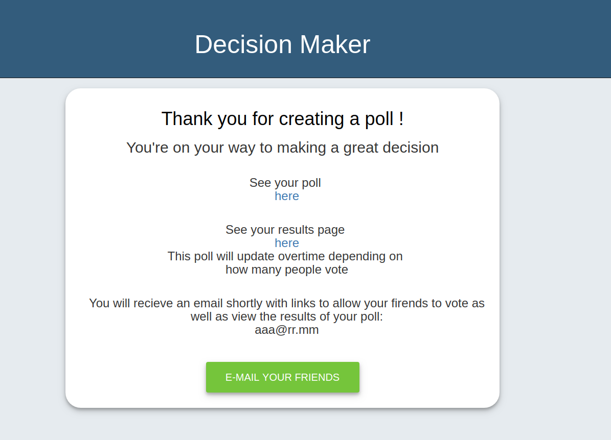

# Decision-Maker
A group project that let users create polls and visitors can rank the options. The result will be mailed.

## Usage
Install the dependencies and start the server.
 
`git clone git@github.com:alvintian/Decision-Maker.git`
 
npm install 
 
connect to psql and provides all necessary infos through .env file:
 
DB_HOST,DB_USER,DB_PASS,DB_NAME,DB_SSL,DB_PORT,GMAIL_USER,GMAIL_PASS,EMAIL_USER
 
knex migrate:latest
 
npm start
 
screenshot:
 

## Dependencies
body-parser
bootstrap
gmail-send
knex
morgan
multer
nodemailer
